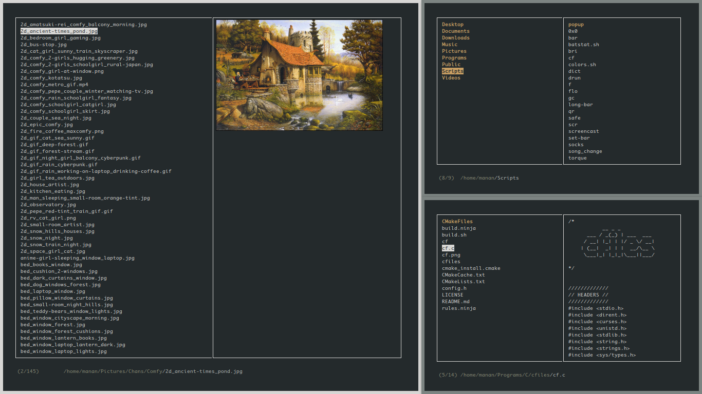

# cfiles
`cfiles` is a work in progress terminal file manager with vim like keybindings, written in C using the ncurses
library. It aims to provide an interface like [ranger](https://github.com/ranger/ranger) while being lightweight, fast and
minimal.

## Dependencies
- ncurses
- `cp`and `mv` for copying and moving
- `fzf` for searching
- `w3mimgdisplay` for image previews
- `xdg-open` for opening programs
- `vim` for renaming, bulk renaming and editing clipboard
- `mediainfo` for viewing media info and file sizes

## Compiling and Installation
To compile, run

   `gcc cf.c -lncurses -o cf`

To install, simply move the generated executable to a directory that is in your `$PATH`

## Keybindings
| Key | Function |
|:---:| --- |
| <kbd>h j k l</kbd> | Navigation keys |
| <kbd>G</kbd> | Go to end |
| <kbd>g</kbd> | Go to top |
| <kbd>H</kbd> | Go to top of current view |
| <kbd>M</kbd> | Go to middle of current view |
| <kbd>L</kbd> | Go to bottom of current view |
| <kbd>f</kbd> | Search using fzf |
| <kbd>F</kbd> | Search using fzf in the present directory |
| <kbd>S</kbd> | Open Shell in present directory |
| <kbd>space</kbd> | Add to selection list |
| <kbd>tab</kbd> | View selection list |
| <kbd>e</kbd> | Edit selection list |
| <kbd>u</kbd> | Empty selection list |
| <kbd>y</kbd> | Copy files from selection list |
| <kbd>v</kbd> | Move files from selection list |
| <kbd>a</kbd> | Rename Files in selection list |
| <kbd>dd</kbd> | Move files from selection list to trash |
| <kbd>dD</kbd> | Remove selected files |
| <kbd>i</kbd> | View mediainfo and general info |
| <kbd>r</kbd> | Reload |
| <kbd>q</kbd> | Quit |

## Directories Used
`cfiles` uses `$HOME/.cache/cfiles` directory to store the clipboard file. This is used so that the clipboard
can be shared between multiple instances of `cfiles`. That's why I won't be adding tabs in `cfiles` because multiple
instances can be openend and managed by any terminal multiplexer or your window manager.
Note that this also means the selection list will persist even if all instances are closed.

`cfiles` also uses `$HOME/.local/share/Trash/files` as the Trash Directory, so make sure this directory exists before you try to delete a file.

## Why C?
I wanted to improve my C and learn ncurses so I decided this would be an ideal project.

Apart from this, I have always wanted an alternative to ranger that is faster while still having
a similar UI.

## Todo
- [x] Improve Upwards Scrolling
- [x] Show sorted directories before files
- [x] Fix the `G` keybinding
- [x] Add basic operations like deleting, copying etc.
- [x] Add rename functionality
- [x] Add option to show selection list
- [x] Show current progress or status of copying files
- [x] Add functionality to open files
- [x] Add image previews using w3mimgdisplay
- [x] Preserve aspect ratio in image previews
- [x] Add fuzzy file search using fzf
- [x] Find a way to redraw windows after displaying image previews or running fzf
- [x] Find a way to remove cursor after running fzf
- [x] Select the file directly from fzf
- [x] Supress output from xdg-open
- [x] Find a way to remember selection position of parent directory
- [x] Add open in terminal functionality
- [x] Add file previews
- [x] Improve file previews
- [x] Add config file for easy user customizability
- [ ] Add more options in config file
- [ ] Add bookmarks
- [ ] Add ability to run external scripts
- [ ] Refactor Code
- [ ] Fix random segfaults
- [ ] Show more info in the statusbar
- [ ] Add color support
